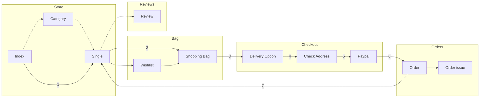
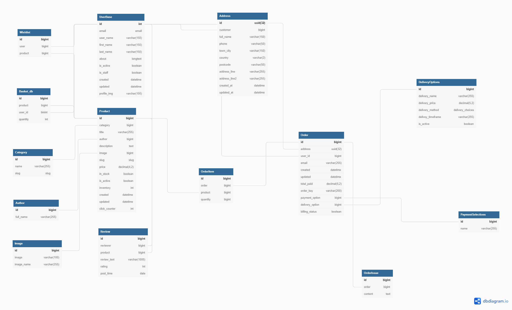
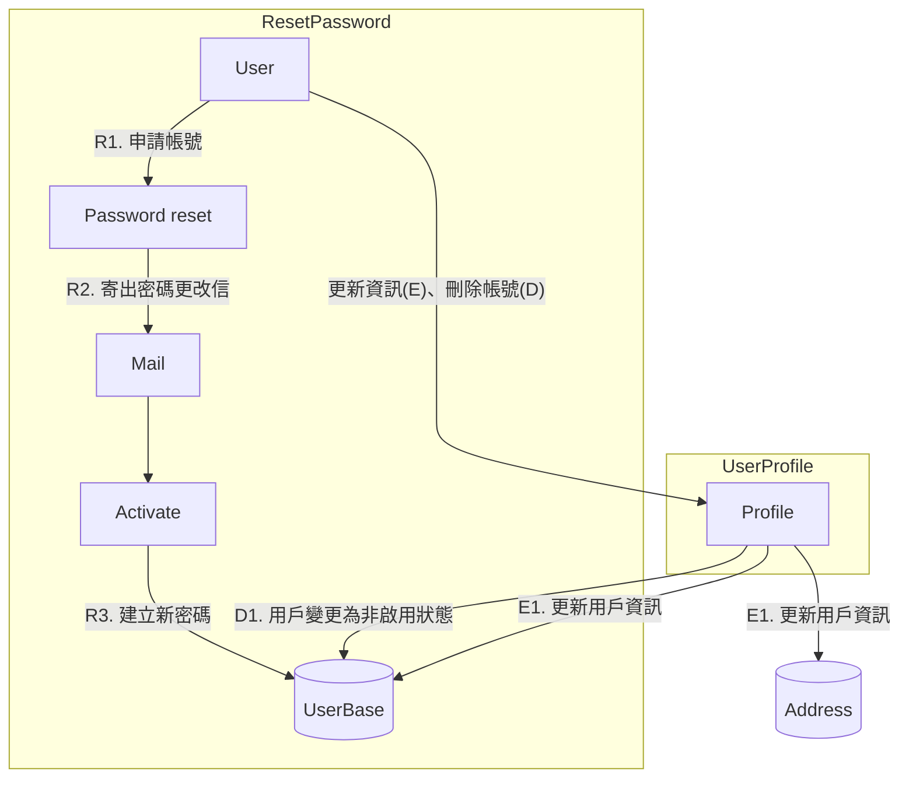
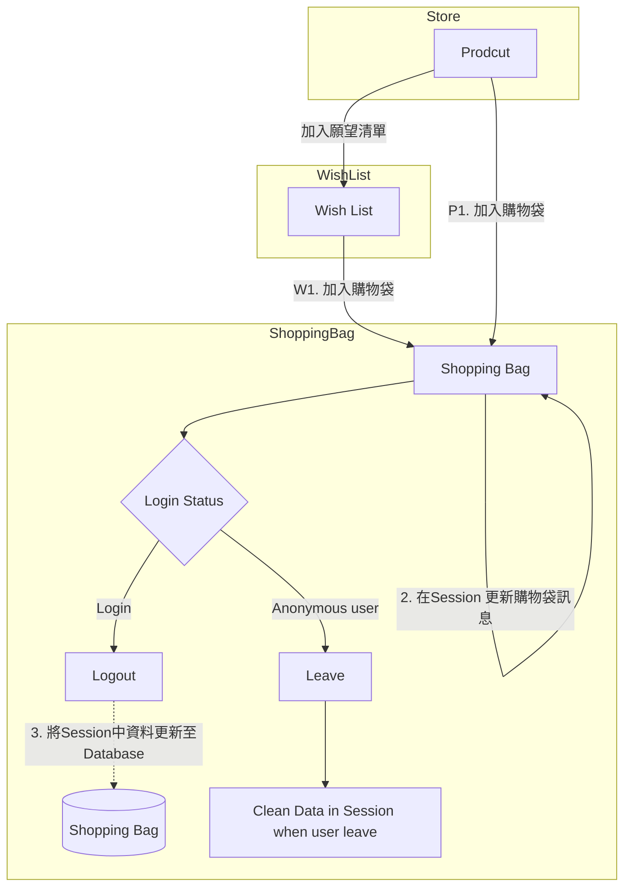
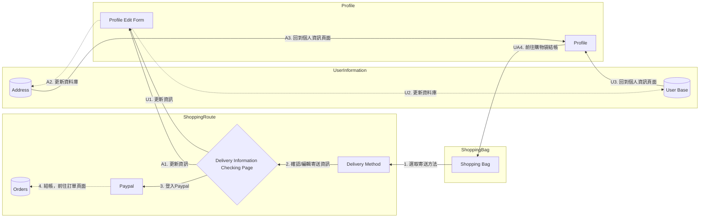
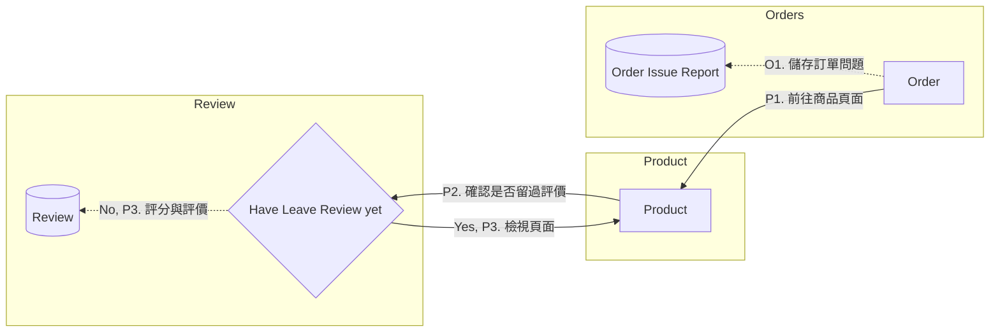

# Tsao Books 網路書店

## 簡介

此網站是後端練習網站，由 <b>Django</b> 框架開發的 <b>MTV</b> 架構網路書店。後端由 <b>Class-based views</b> 為主輔以 <b>Function-based views</b> 作為業務邏輯層(V)，搭配 <b>MySQL</b> 作為資料庫(M)；前端頁面(T)則以原生 <b>Django template</b> 為主，搭配 <b>Jquery(ajax)</b> 與 <b>CSS</b> 實作互動功能與排版。
 
 

## 套件

     

## 網頁Demo

<https://stevetsaoch.pythonanywhere.com/>

*若你想獲得完整體驗，可以用下列帳戶測試。*

### 測試帳號

- 用戶：
  - User name: AllenDanvers
  - Password: qazxcv123

### 付款帳戶

- Paypal
  - Account: paypalpublic@paypal.com
  - Password: paypalpublic1

 

## 網站架構

__*備註: 實線箭頭：預設流程; 虛線箭頭：可選擇流程*__
 

## 資料庫架構

連結: <https://dbdiagram.io/d/6253befa2514c979030773a2>

 

## 主要練習

- Django
  - Class-based views
    - Override method以符合業務需求
    - 以 REST 風格撰寫部分功能(購物袋、願望清單)
  - Function-based views
  - Models, Forms
  - Eamil function
  - Session (購物袋管理)
  - Custom Template tags
  - Custom commands (生產假資料)
  - Token for authentication

- MySQL
  - 資料庫正規化(Normalization)

- 串接 Paypal 金流支付 API

- Jquery
  - 首頁翻頁、更新商品數量與刪除商品
  - 即時顯示評論
  - 紀錄商品點擊數 (用於找出Bestsellers)

- CSS
  - 製作簡易動畫(指向選項時改變背景，選取後產生陰影特效等)
  - Responsive Web Design
 

## 網頁內容介紹

- 商品頁面
  - 商品預覽、評分預覽
  - 最受歡迎商品
  - 促銷活動
- 使用者相關功能
  - 註冊
  - 登入、登出、更改密碼
  - 更新使用者資料
  - 刪除使用者
- 願望清單
  - 新增、刪除
  - 加入購物袋
- 購物車
  - 新增、刪除
  - 更新個別商品數量
  - 使用者登出時更新相關資料庫
- 評價功能
  - 購買後可以為商品撰寫評價
- 訂單管理
  - 檢視訂單
  - 回報訂單問題

## 網頁功能流程圖

__*備註: 實線箭頭：流程; 虛線箭頭：流程中包含更新資料庫*__

### 使用者功能

#### 註冊帳號

---

#### 更改密碼、刪除用戶、更新資訊

---

### 購物袋與願望清單

---

### 結帳

---

### 訂單管理與商品評價

