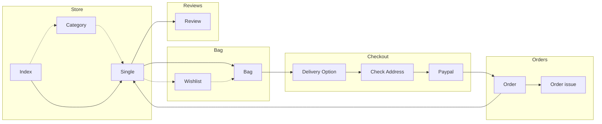

# Tsao Books 網路書店

此網站是後端練習網站，由 <b>Django</b> 框架開發的 <b>MTV</b> 架構網路書店。後端由 <b>Class-based views</b> 為主輔以 <b>Function-based views</b> 作為業務邏輯層(V)，搭配 <b>MySQL</b> 作為資料庫(M)；前端頁面(T)則以原生 <b>Django template</b> 為主，搭配 <b>Jquery(ajax)</b> 與 <b>CSS</b> 實作互動功能與排版。
 
 
 

## 資料庫架構與路線圖

---

### 資料庫架構

### 網站架構

<small>__*備註：*__</small>

<small>__*實線箭頭：預設路線*__</small>

<small>__*虛線箭頭：替代路線*__</small>

基本功能:

1. 註冊
2. 登入
3. 登出

購物袋:

1. 將購物車寫進session中，並額外寫class控制購物車功能
2. 增加，減少，刪除
3. 當用戶沒有登入離開時會直接刪除session中的資料，若是登入狀態登出則會比對session與database中的記錄新增/更新

願望清單:

1. 新增更新願望清單
2. 將願望清單商品加入購物袋(數量為1)

結帳:

1. 選取寄送方式
2. 更新寄送地址
3. Paypal 付款

訂單與評價

1. 付款完成後會建立訂單，可以在訂單頁面查詢訂單
2. 回報訂單問題
3. 連結並評價商品
