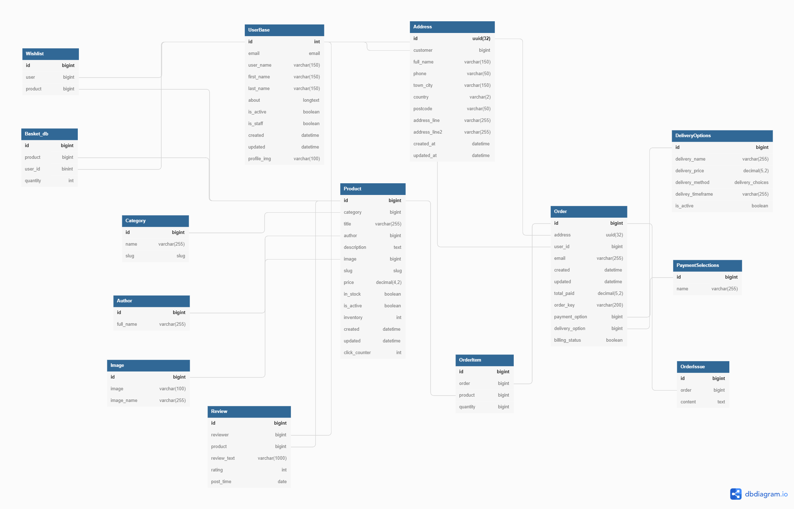

# Tsao Books 網路書店

## 簡介

---
此網站是後端練習網站，由 <b>Django</b> 框架開發的 <b>MTV</b> 架構網路書店。後端由 <b>Class-based views</b> 為主輔以 <b>Function-based views</b> 作為業務邏輯層(V)，搭配 <b>MySQL</b> 作為資料庫(M)；前端頁面(T)則以原生 <b>Django template</b> 為主，搭配 <b>Jquery(ajax)</b> 與 <b>CSS</b> 實作互動功能與排版。
 
 

## 網頁Demo

<https://stevetsaoch.pythonanywhere.com/>

 

## 資料庫架構

---

 

## 網站架構

---

備註: 實線箭頭：預設路線; 虛線箭頭：替代路線

 

## 主要練習

---

- Django
  - Class-based views
    - 重寫方法以符合業務需求
    - 嘗試以 REST 風格撰寫
  - Function-based views
  - Model, Form
  - Eamil function
  - Session (購物袋管理)
  - Custom Template tags
  - Custom commands (生產假資料)
  - Use Token for authentication
- MySQL
  - 資料庫正規化(Normalization)
- 串接 Paypal 金流支付 API
- Jquery
  - Ajax
    - 首頁翻頁、更新商品數量與刪除商品
    - 即時顯示評論
    - 紀錄商品點擊數 (用於找出Bestsellers)
- CSS
  - 製作簡易動畫(指向選項時改變背景，選取後產生陰影等)
  - Responsive Web Design
 

## 網頁功能介紹

---

### 使用者功能

- 註冊帳號

- 更改密碼、刪除用戶、更新資訊

- 購物袋

購物袋:

1. 將購物車寫進session中，並額外寫class控制購物車功能
2. 增加，減少，刪除
3. 當用戶沒有登入離開時會直接刪除session中的資料，若是登入狀態登出則會比對session與database中的記錄新增/更新

願望清單:

1. 新增更新願望清單
2. 將願望清單商品加入購物袋(數量為1)

結帳:

1. 選取寄送方式
2. 更新寄送地址
3. Paypal 付款

訂單與評價

1. 付款完成後會建立訂單，可以在訂單頁面查詢訂單
2. 回報訂單問題
3. 連結並評價商品

## 需求

---
